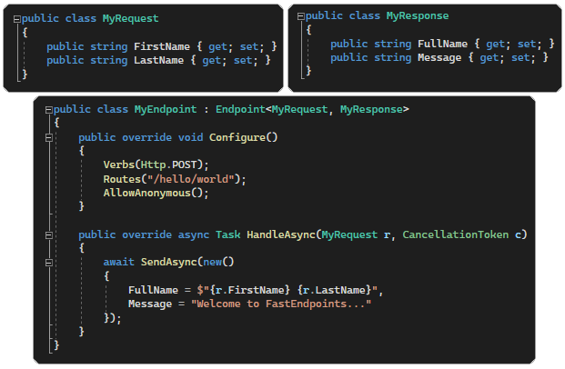

  

    

A light-weight REST Api framework for ASP.Net 6 that implements **[REPR (Request-Endpoint-Response) Pattern](https://deviq.com/design-patterns/repr-design-pattern)**.

**FastEndpoints** offers a better alternative than the **Minimal Api** and **MVC Controllers** with the aim of increasing developer productivity. Performance is on par with the Minimal Api and is faster; uses less memory; and does around **[45k more requests per second](https://fast-endpoints.com/wiki/Benchmarks.html)** than a MVC Controller in a head-to-head comparison.

 

  

# Features
- Define endpoints in multiple class files (even in deeply nested folders)
- Auto discovery & registration of endpoints
- Attribute-free endpoint definitions (no attribute argument type restrictions)
- Secure by default & supports most auth providers
- Built-in support for JWT Bearer auth scheme
- Supports policy/permission/role/claim based security
- Declarative security policy building (in each endpoint)
- Supports any IOC container compatible with asp.net
- Constructor & property injection of endpoint dependencies
- Easy model binding from route/query/json body/claims/forms/headers
- Json source generator support for request/response dtos
- Easy file handling (multipart/form-data)
- Model validation with FluentValidation rules
- Convenient business logic validation & error responses
- Easy access to environment & configuration settings
- API versioning
- Rate limiting
- Response caching
- In-process pub/sub event notifications (with auto discovery)
- Easy Server-Sent-Events real-time data streaming
- Convenient integration testing (route-less & strongly-typed)
- Built-in uncaught exception handler
- Supports swagger/serilog/etc.
- Visual studio extension (vsix) for easy vertical slice feature scaffolding
- Plays well with the asp.net middleware pipeline
- Plus anything else the `Minimal APIs` can do...

---

<a href="https://dev.to/djnitehawk/building-rest-apis-in-net-6-the-easy-way-3h0d">Tutorial</a>

  
<a href="wiki/Get-Started.md">Documentation</a>

  
<a href="wiki/Benchmarks.md">Benchmarks</a>

---

  

